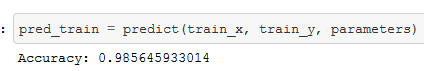
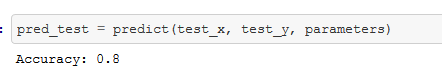

### Readme- Cat Recognizer

#### Brief Description-
- Here a deep neural network is classifying between cat vs non-cat image with an accuracy of 80 % on Test Set. 

#### Methods Used-
- L- Layer Neural Network

#### Technologies Used-
- Python
- Numpy
- Matplotlib
- SciPy
- H5py

#### Getting Started-
- Just clone the entire repo and run the Jupyter Notebook.

#### Output-
- Output ::
  - 
  -   
- [Rest the output can be seen in Jupyter Notebook](https://github.com/gadia-aayush/Cat-Recognizer/blob/master/deep-neural-network-application%20%5Bcat%20recognizer%5D.ipynb).
